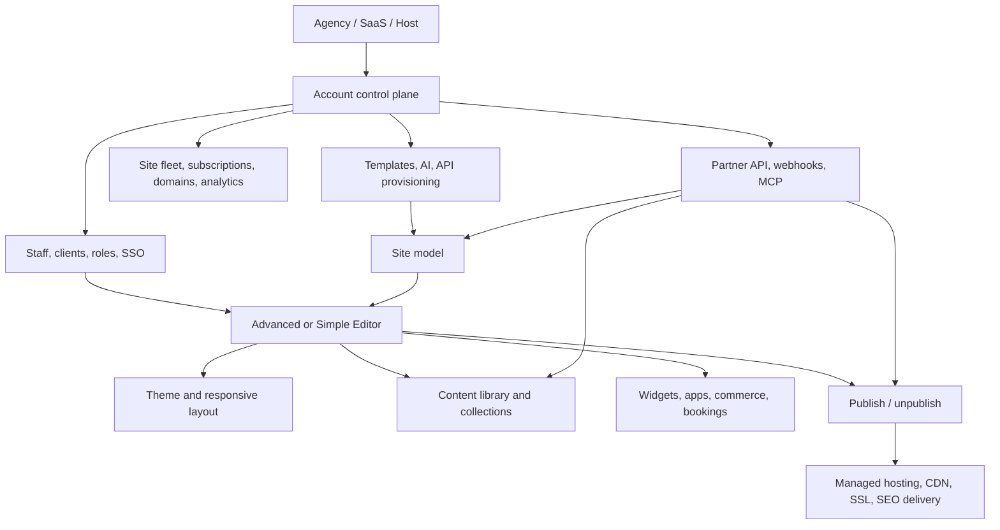

# Duda Platform Reference — A Model for Archura

**Research snapshot:** July 17, 2026  
**Purpose:** Durable product and architecture reference for deciding what Archura should imitate, avoid, and improve as it grows from an embeddable editor into a multi-site platform.  
**Status:** Strategic reference, not an implementation specification. Recheck live pricing, limits, and beta features before using them in a commercial decision.

## Executive thesis

Duda is best understood as a **B2B2C website-production operating system** for agencies, hosts, SaaS companies, and other organizations serving many small businesses. Its visual editor matters, but its defensibility comes from the system surrounding it:

- repeatable site creation from templates and structured business data;
- a controlled editing experience for professionals and end clients;
- centralized management of many sites, users, permissions, subscriptions, and domains;
- white-label access and single sign-on;
- APIs, webhooks, collections, custom widgets, and an app ecosystem;
- managed publishing, hosting, security, analytics, SEO, commerce, and maintenance;
- AI operations that act across this control plane, not only inside a text box.

The most useful goal for Archura is therefore **not “copy Duda’s builder.”** It is:

> Build a safer, more composable, agent-native version of Duda’s production system, while preserving Archura’s portable web-component artifacts, host-owned integration boundaries, and stronger transaction/security primitives.

The strategic boundary is important. Duda is a broad, mature, proprietary site platform. Archura should borrow its operating model without inheriting all of its surface area or lock-in.

## 1. Duda in one sentence

Duda lets an organization create, sell, provision, edit, publish, and manage large numbers of professional websites under its own brand.

Its core buyers are not primarily individual DIY users. They are:

- digital agencies and freelancers;
- vertical SaaS companies adding websites to an existing product;
- hosting and domain providers;
- local-business and marketing platforms;
- point-of-sale and commerce providers;
- larger organizations operating a distributed web presence.

Duda supports three delivery modes from the same underlying platform:

| Mode | Meaning | Typical customer journey |
|---|---|---|
| DIY | Do it yourself | The end customer chooses a design, enters business data, edits, upgrades, and publishes. |
| DIWM | Do it with me | The provider creates the starting point and the client collaborates or maintains content. |
| DIFM | Do it for me | The provider’s team builds and manages the site for the client. |

This flexibility is strategically significant: one platform can support low-touch acquisition, assisted onboarding, and higher-margin professional services.

## 2. Business profile and economics

### Market position

Duda describes itself as a platform for web professionals serving small businesses. Its public site currently claims more than **450,000 businesses**, **100 million monthly site visits**, and **14 million sites built** across its history. Treat these as company-reported scale indicators, not audited customer or active-site counts. See [Duda’s company overview](https://www.duda.co/about).

In 2021, Duda announced a $50 million Series D, bringing disclosed funding at the time to more than $100 million. The announcement said the platform then had more than one million published, paying sites built by more than 17,000 customers. See [Duda’s funding announcement](https://blog.duda.co/duda-50-million-dollar-funding-june-2021-itai-sadan).

### Revenue and ARR

Duda is private and does not publish audited revenue or ARR. The best available numbers are estimates:

| Measure | Best reference | Confidence |
|---|---:|---|
| 2024 estimated ARR | **About $41.2 million** | Low-to-medium; third-party estimate, not company disclosure |
| Defensible working range | **Roughly $25–75 million ARR** | Low; useful only for company-scale reasoning |
| Disclosed funding | **More than $100 million by 2021** | High; company announcement |

The $41.2 million estimate comes from [Latka’s Duda profile](https://getlatka.com/companies/duda). It should never be presented as reported financial performance. Duda’s enterprise contracts, negotiated volume pricing, app revenue, and changing active-site count make bottom-up reconstruction unreliable.

The important lesson is not the exact ARR. It is that Duda has built a meaningful recurring software business by monetizing both the **operator account** and the **growing fleet of sites** that account manages.

### Pricing architecture

Duda separates account capability from website capacity:

1. The customer buys an account plan to unlock team size, permissions, code access, white labeling, AI, APIs, and support.
2. The customer buys or consumes a recurring site subscription for each active website.
3. Additional paid capabilities—commerce, bookings, apps, or services—raise revenue per site.
4. Custom customers negotiate volume pricing and enterprise services.

Current advertised annual-billing prices are:

| Plan | Advertised price | Included sites | Primary expansion lever |
|---|---:|---:|---|
| Basic | $19/month | 1 | Additional sites |
| Team | $29/month | 1 | Team/client management and additional sites |
| Agency | $52/month | 4 | Six team members, code/export, widgets, AI/MCP |
| White Label | $149/month | 4 | Branded domain, login, communications, and support portal |
| Custom | Negotiated | Flexible | Volume, API, SSO, Simple Editor, external datasets, SLA, services |

Additional sites are advertised at $19 per month on Basic or $17 per month on Team, Agency, and White Label, with discounted annual pricing. Duda explicitly describes this as separating **features from websites**. Verify details on [Duda’s pricing page](https://www.duda.co/pricing).

This creates a strong recurring-revenue loop:

```text
more operator capability
        ↓
faster customer acquisition and production
        ↓
more active sites
        ↓
more per-site subscriptions and add-ons
        ↓
higher switching cost and deeper platform use
```

### Likely moat

Duda’s moat is cumulative workflow depth rather than a single unique editor feature:

- a production team can manage many sites with one set of processes;
- templates, sections, content forms, collections, and APIs turn repeated work into reusable infrastructure;
- client roles and locking reduce support and rework;
- white labeling lets the customer own the downstream relationship;
- hosted publishing removes infrastructure decisions;
- integrations and extensions make replacement progressively more expensive;
- historical site and customer fleets create durable per-site recurring revenue.

## 3. The platform as a system



The diagram explains why evaluating Duda only by dragging elements around a canvas misses most of the product.

## 4. How Duda’s builder works

### 4.1 Site hierarchy

At a useful conceptual level, Duda sites are composed as:

```text
Site
├── global theme and site settings
├── header and navigation
├── pages
│   ├── sections / rows
│   │   ├── columns, flex containers, or grids
│   │   │   └── widgets
│   │   └── connected or repeated content
│   └── SEO, access, and page settings
└── footer
```

The platform currently has a Classic Editor and Editor 2.0. Editor 2.0 moves the layout model toward flexbox and CSS Grid, including nested containers, overlapping elements, and responsive overrides. This is a reminder that mature builders accumulate compatibility obligations; it is also a warning for Archura to version its artifact and component contracts early. See [Duda’s editor-version guide](https://support.duda.co/hc/en-us/articles/26519259154199-Editor-Versions).

### 4.2 Main editing surfaces

The advanced editor combines:

- a top navigation and device/preview controls;
- a side panel for pages, layers, themes, CMS, widgets, SEO/AEO, store, bookings, apps, and settings;
- a central live canvas;
- a contextual content/design panel for the selected element;
- site-wide and page-specific management outside the canvas.

The current [editor overview](https://support.duda.co/hc/en-us/articles/26519221644439-Editor-Overview) shows that Duda is consolidating operational features into the same shell. The editor is therefore both a design tool and a gateway into the site’s business configuration.

### 4.3 Widgets as the reusable unit

Widgets are the standard building blocks: text, images, buttons, galleries, forms, maps, menus, HTML, and more specialized business functions. Each widget exposes curated content and design controls. Duda does not require the end user to manipulate raw HTML and CSS for ordinary work.

This is close to Archura’s component-trait and custom-property contract. The important shared idea is:

> A component author defines the safe editing surface; the client edits through that surface.

Duda also offers a Custom Widget Builder using HTML, CSS, JavaScript, structured inputs, and server-rendered Handlebars output. Widgets can access site data and collections through Duda APIs. See [Duda’s widget introduction](https://developer.duda.co/docs/widget-introduction).

### 4.4 Content versus design

Duda usually separates what an element says or contains from how it looks:

- **Content:** text, links, media, records, product data, business information.
- **Design:** colors, typography, spacing, alignment, sizing, backgrounds, borders, animations, and responsive behavior.

This separation improves usability, permissions, automation, and migration. It also lets structured data be replaced without reconstructing layout.

### 4.5 Theme cascade

The site theme controls global typography, buttons, images, backgrounds, navigation, and related defaults. Local page or widget settings can override the theme. See [Duda’s site-theme documentation](https://support.duda.co/hc/en-us/articles/26519231815063-Site-Theme).

The underlying product principle is more important than Duda’s exact controls:

```text
platform defaults → template defaults → site theme → page/section settings → instance override
```

Archura’s theme-token plus component custom-property model already follows this principle and should remain more explicit and portable.

### 4.6 Responsive behavior

Editor 2.0 uses a main breakpoint plus tablet and mobile overrides. Layout is based on flexbox and grid, and the editor shows responsive changes on the canvas. Archura already has a deliberately constrained desktop-first breakpoint model. The Duda lesson is to make inheritance and override source obvious, not to add unlimited breakpoints.

### 4.7 Templates, pages, and reusable sections

Duda can create a site from a template in the UI or through the Partner API. The API accepts a unique site identifier, template, domain prefix, language, labels, and structured site data. See [Create Site](https://developer.duda.co/reference/sites-create-site).

Reusable assets exist at several levels:

- full site templates;
- page templates;
- saved or global sections;
- widgets;
- theme configuration;
- content-collection forms;
- structured collections.

The production gain comes from combining these primitives. A template provides structure; business data fills it; an operator or client handles exceptions.

### 4.8 Simple Editor

Duda’s Simple Editor is a separate, constrained one-page flow for nontechnical clients on Custom plans. It guides the user through five onboarding steps, fills premade sections, and permits only a smaller set of actions such as changing the theme, toggling sections, editing text/media/buttons, and setting SEO information. The operator can configure available sections and route an “Advanced” action to an upgrade flow.

This is one of Duda’s strongest product ideas for Archura. It turns editing constraints into a commercial funnel: a low-risk self-service experience can lead to a paid advanced editor or professional service. See [Duda’s Simple Editor guide](https://support.duda.co/hc/en-us/articles/26519443654039-Simple-Editor).

Archura should implement this as **capability modes over one artifact model**, not as unrelated editors that create incompatible artifacts.

## 5. Structured content and dynamic sites

### Content library and collection forms

Duda centralizes business information, text, and media so the same data can populate multiple parts of a site. Agencies can send clients a content-collection form before or during production. Responses flow into the content library, and templates can carry configured forms. AI can recommend questions from business context. See [Import and Collect Content](https://support.duda.co/hc/en-us/articles/26519965613847-Import-and-Collect-Content).

This solves a problem that canvas-first products often neglect: obtaining complete, usable client content is frequently a larger bottleneck than drawing the page.

### Collections

Duda collections behave like small structured databases. Sources include:

- internal collections;
- Google Sheets;
- Airtable;
- external APIs on higher plans.

Fields can be connected to widgets on ordinary pages or used to generate dynamic pages. See [Duda’s collections overview](https://support.duda.co/hc/en-us/articles/26519939555095-Dynamic-Content-Collections).

### Dynamic pages

A dynamic-page layout connects to a collection, and each collection row becomes a page using the same layout. This supports directories, locations, staff, properties, catalogs, services, and other repeated content. See [Duda’s dynamic-page developer guide](https://developer.duda.co/docs/dynamic-pages).

Known product constraints are instructive: dynamic pages cannot be membership pages, and Duda warns that media on membership pages remains directly accessible by URL. Archura should not conflate page visibility with asset security.

### Archura implication

Archura should keep three layers distinct:

1. **Component schema** — which inputs and style controls a component accepts.
2. **Content records** — reusable structured data independent of layout.
3. **Page binding** — how a component instance or repeated page references a record.

The canonical artifact can contain a rendered snapshot plus stable references, but the server-side record remains authoritative for live business or regulated data.

## 6. Multi-tenant control plane

### Accounts, staff, clients, and sites

Duda models an operator account above individual sites. Staff and clients can be assigned to specific sites with different rights. Duda exposes granular client permissions for content, design, connected data, dynamic pages, SEO, commerce, developer mode, publishing, statistics, apps, comments, and backups. See [Manage Clients](https://support.duda.co/hc/en-us/articles/26519392519575-Manage-Clients).

The platform can also lock elements so clients cannot modify selected widgets, rows, columns, or sections. See [Manage Elements](https://support.duda.co/hc/en-us/articles/26519222277143-Manage-Elements).

This is a core operational feature, not a minor access-control option. It allows a professional to delegate content maintenance without giving up design and compliance guarantees.

### White labeling and SSO

White-label customers can brand the platform domain, login, communications, support experience, and editor. Custom customers can use APIs and SSO to provision users and send them directly into a dashboard, site overview, store, statistics, or editor. See [Duda’s SSO endpoint](https://developer.duda.co/reference/authentication-get-sso-link) and [white-label platform overview](https://www.duda.co/website-builder/white-label).

The useful pattern for Archura is a short-lived, destination-scoped handoff:

```text
partner identity
    → Archura token exchange
    → tenant + site + role + allowed actions
    → branded editor route
```

This aligns with Archura’s existing tenant-scoped auth design. The host may own user authentication, while Archura remains authoritative for site/component capabilities and sensitive actions.

### Site lifecycle

Duda exposes lifecycle state through its APIs, including never-published, published, and unpublished states, as well as editor type, store state, SSL state, labels, and external identifiers. Publish/unpublish events can trigger webhooks.

Archura should preserve a richer but equally explicit lifecycle:

```text
template → draft → review/armed → published → superseded/rolled back → archived
```

The state machine should be queryable and auditable; a “Publish” button alone is not a platform contract.

## 7. APIs, extensions, and ecosystem

### Partner API

Duda’s Partner API covers site creation, content injection, domains, plans, users, permissions, collections, themes, publishing, analytics, commerce, and SSO. Webhooks cover site, content, comments, collections, stores, bookings, memberships, pages, blogs, domains, and Simple Editor events. The [developer portal](https://developer.duda.co/) is a useful catalog of what a mature control-plane API eventually needs.

### App Store

Apps can add editor UI, native widgets, site-wide scripts, external services, payment gateways, and other capabilities. Duda manages installation lifecycle, authentication, scopes, SSO into app interfaces, plans, upgrades, and webhooks.

Archura should not build a public marketplace early. It should first make the component contract versionable and the installation lifecycle explicit. A marketplace amplifies whatever security, compatibility, and support model already exists.

### Custom widgets

Duda custom widgets use declarative content/design inputs plus HTML, CSS, and JavaScript. This demonstrates a good split:

- the extension author receives power;
- the client receives curated controls;
- the platform retains a predictable editor experience.

Archura can improve this by making standard web components the deployable unit and preserving an inspectable component manifest instead of binding extensions to a proprietary runtime.

## 8. Publishing, hosting, SEO, and operations

Duda includes managed AWS hosting, storage, bandwidth, SSL, CDN delivery, backups, and publishing. Its platform marketing emphasizes server-side rendering, automated schema and sitemaps, IndexNow, SEO metadata, and AI-search/AEO readiness. Current advertised SLA and uptime language varies by page and plan; verify the actual contract rather than relying on marketing summaries.

This integrated delivery model is convenient and commercially powerful, but it is one area where Archura should remain more modular:

- canonical artifacts should be deployable through host adapters;
- a first-party managed path should be the easiest option;
- the artifact should remain portable enough for other delivery targets;
- publish records, versions, and rollback should be first-class regardless of target.

Archura’s existing persistence adapter, Worker/R2 publishing path, and host-owned deployment boundary are therefore advantages to preserve, not temporary gaps to erase.

## 9. Commerce, bookings, and memberships

### Commerce and bookings

Duda sells commerce/bookings as additional site subscriptions. Current annual-billing prices are advertised at $7/month for Standard, $20/month for Advanced, and $45/month for Elite. Product limits rise from 100 to 1,000 to 20,000, while the higher plans add digital goods, subscriptions, automated tax/shipping, and more calendars. Duda advertises no additional platform transaction fee, although payment processors charge their own fees. See [Duda’s commerce pricing](https://www.duda.co/ecommerce/pricing).

This is an attach-rate strategy: a basic site becomes more valuable and harder to replace as it acquires business operations.

### Memberships

Duda supports simple membership and plan-based access, including free and paid plans. Access applies to selected pages, with login, signup, pending, and access-denied flows. Important limitations include:

- uploaded media is not secured merely because it appears on a protected page;
- dynamic pages cannot be membership pages;
- removing membership deletes membership data;
- paid plans must be tested on a published site.

See [Duda’s membership guide](https://support.duda.co/hc/en-us/articles/26519223937943-Membership).

### Archura implication

Archura should resist recreating a full generic commerce suite. Its differentiated path is:

- composable transaction components;
- Stripe Connect and application-fee economics where appropriate;
- server-authoritative actions and webhook state;
- short-lived, origin- and capability-bound component sessions;
- regulated workflows living in the Go core, not in the visual artifact or edge cache.

Duda monetizes commerce mainly through recurring add-ons. Archura may combine recurring component/site subscriptions with transaction or platform revenue, but only where it adds real operational value and maintains a clear compliance boundary.

## 10. AI and agent strategy

### Current Duda AI stack

Duda’s AI capabilities now span:

- business-context profiles;
- content generation, editing, translation, and proofreading;
- image alt text;
- SEO titles and descriptions;
- blog, section, page, and multi-page site generation;
- content-collection question generation;
- custom-widget generation;
- an in-product Copilot for account and site operations;
- an MCP server exposing operational tools to external assistants.

On July 15, 2026, Duda announced improved agentic site generation, an AI Custom Widget generator, and **Duda Vibe**, a conversational environment intended to create richer websites and web applications. These are newly announced capabilities and should be treated as emerging until independently evaluated. See [Duda’s July 2026 announcement](https://blog.duda.co/duda-expands-ai-2026).

### MCP

Duda’s MCP server wraps its Partner API. Current examples include retrieving and publishing sites, updating the content library and collections, managing blogs and products, reading analytics, managing users, permissions, and SSO. Duda labels the feature beta and warns that it can make permanent changes. See [Duda’s MCP guide](https://developer.duda.co/docs/dudas-mcp).

The crucial lesson is that AI becomes more valuable after the platform has stable resources and actions:

```text
typed site/content/user operations
        +
authorization and lifecycle rules
        +
preview, approval, audit, and rollback
        =
useful agentic website operations
```

An LLM manipulating raw HTML is not equivalent.

### Archura’s opportunity to improve

Archura should make AI actions safer than Duda’s current warning-based model:

- agents propose typed operations against canonical resource IDs;
- every operation produces a previewable diff;
- destructive or publishing actions require policy-based approval;
- operations are idempotent where possible;
- the platform records actor, model/provider, inputs, resource version, and result;
- stale writes fail on version conflict rather than silently overwriting work;
- rollback is available for site, theme, component, and content mutations;
- agents receive the minimum tenant/site capabilities required for a run.

This is where the service-node/run-manager design can become a meaningful advantage rather than a layer of AI branding.

## 11. Competitive frame

The closest comparisons depend on which part of Duda is being evaluated:

| Company/product | Closest overlap | Important difference from Duda | Revenue/ARR note |
|---|---|---|---|
| Wix Studio | Agency-oriented builder and client management | Backed by a much larger consumer website platform | Wix is public; company revenue is far larger than Duda, so direct ARR comparison is misleading |
| Webflow | Professional visual building, CMS, hosting, ecosystem | More designer/developer oriented and less centered on white-label fleet operations | Private; current ARR is not consistently disclosed |
| Squarespace | Managed sites, commerce, domains, scheduling | Primarily direct-to-customer rather than white-label B2B2C | Revenue scale is far larger than Duda; now private after acquisition |
| Framer | Fast professional visual sites and AI generation | Less of a multi-tenant agency/SaaS control plane | Private; no reliable public ARR |
| WordPress + managed hosts | Extensibility, agencies, large installed base | Open ecosystem assembled from many vendors rather than one integrated control plane | Ecosystem, not one comparable ARR figure |
| Vendasta | White-label SMB services sold through partners | Broader local-business operating platform; website building is one module | Private; estimates vary |
| Builder.io / Plasmic | Embeddable visual authoring and component integration | More headless/composable; less complete site-fleet operations | Private; no reliable public ARR |
| Durable / Lovable and similar AI builders | Conversational site/app creation | Faster greenfield generation, but generally less mature in fleet governance and client operations | Private and early; estimates are unstable |
| Outseta | SaaS back office: auth, billing, CRM, email, support | Complements a builder rather than replacing Duda’s design/hosting platform | Private; no audited public ARR |

Duda’s estimated 2024 ARR is roughly **$41.2 million**, but all private-company ARR comparisons should be labeled as estimates and refreshed before external use.

## 12. Duda-to-Archura capability map

| Capability | Duda model | Archura today / documented direction | Decision |
|---|---|---|---|
| Visual editing | Flexible widget/section/page canvas | Constrained GrapesJS editor over Lit web components | Keep Archura constrained; improve polish, not arbitrary freedom |
| Component controls | Widget content/design inputs | Traits plus allowlisted custom properties and stylable parts | Directly aligned; formalize manifests and versioning |
| Pages | Free composition plus page templates | Developer-authored, structure-locked pages | Preserve safety; later add operator-only composition if demand proves it |
| Responsive design | Main layout plus tablet/mobile overrides | Three-bucket desktop-first model | Keep bounded model; add clearer inheritance indicators |
| Themes | Global theme with local overrides | Theme tokens with instance overrides | Keep and expand into a versioned site theme resource |
| Templates | Site/page/section templates | Developer-authored pages and component registry | Add template catalog, versions, and explicit upgrade/fork semantics |
| Content library | Central business data and media | Structured component content plus asset pipeline | Add reusable site/tenant content records |
| Client content intake | Shareable forms with template/AI support | Not yet a primary workflow | High-value near-term feature after site model |
| Collections/dynamic pages | Internal and external records bound to layouts | Articles/CMS direction documented | Build generic record/binding primitive before many vertical apps |
| Fleet dashboard | Sites, clients, team, billing, domains, analytics | Thin dashboard planned; current focus component/core APIs | Expand only after stable site resource and lifecycle exist |
| Permissions | Staff/client roles, site rights, element locking | Tenant-scoped auth and component sessions | Add explicit site roles and edit-capability policies |
| White label/SSO | Branded platform and destination SSO | Embeddable elements and host-owned auth direction | Strong fit; implement scoped token exchange, not shared secrets |
| Publishing | Managed host/CDN/SSL | Adapter-based persistence and Worker/R2 path | Keep modular with first-party default and first-class rollback |
| Extensions | Custom widgets and App Store | Serializable component registry and web components | Prefer open manifests; delay marketplace |
| Commerce | Integrated store/bookings/memberships | Stripe/data-connected component and regulated Go core | Differentiate on composable, secure transaction primitives |
| AI | In-editor generation, Copilot, Partner API through MCP | Run-manager/agent-adapter architecture proposed | Make typed diffs, approvals, audit, and rollback the product advantage |

## 13. What Archura should imitate

### 1. Build the control plane around the canvas

The site, tenant, user, role, template, domain, subscription, content source, publish version, and analytics record must become first-class resources. The canvas should edit one version of one resource; it should not be the only place the platform state exists.

### 2. Separate account plans from consumption

A future pricing model can distinguish:

- platform/agency capability;
- active sites or deployed components;
- premium operational modules;
- API/automation volume;
- managed services;
- transaction revenue where justified.

This is more durable than charging only for editor seats.

### 3. Treat repeatability as the main productivity feature

Prioritize templates, reusable sections/components, site themes, content intake, structured records, and API provisioning. These let one operator serve many customers consistently.

### 4. Give clients less power on purpose

Roles, locks, capability modes, and schema-defined controls reduce mistakes and support cost. Archura’s “mistakeless envelope” is a stronger expression of this idea than a general-purpose design canvas.

### 5. Make structured content independent from presentation

Business information and collection records should populate components without becoming inseparable from their rendered HTML.

### 6. Make white labeling operational, not cosmetic

Branding must include identity handoff, domains, routes, communications, permission bundles, support boundaries, and tenant-specific configuration—not merely logo replacement.

### 7. Turn APIs into a product surface

The API should support the same resource lifecycle as the UI. Webhooks should expose meaningful state changes. MCP can then wrap safe, stable operations instead of screen automation.

## 14. What Archura should avoid

### 1. Feature-for-feature cloning

Rebuilding a generic store, scheduler, blog, CRM, membership system, analytics suite, and app marketplace at once would bury the differentiators and create a support-heavy platform before the core model is stable.

### 2. Multiple incompatible editors

Duda’s Classic, Editor 2.0, and Simple Editor illustrate the compatibility burden of product evolution. Archura should expose simple, client, professional, and agent modes over the same canonical resources and operation model whenever possible.

### 3. Making snapshots the source of truth for live business data

Rendered artifacts are excellent delivery records. They are the wrong authority for inventory, payment state, identity, permissions, credit, or other changing/regulated information.

### 4. Treating page access as data security

Protected navigation does not secure directly addressable assets or API data. Authorization must be enforced where the protected resource is served.

### 5. Premature marketplace governance

First establish manifests, signing/provenance, scopes, version compatibility, install/uninstall behavior, data ownership, review policy, and failure isolation.

### 6. Permanent AI mutations without a transaction model

Warnings are not enough. Agent actions need versions, diffs, approvals, audit events, idempotency, and rollback.

### 7. Hiding lock-in inside convenience

Managed hosting can be the default while artifacts and component contracts remain inspectable and portable. Portability is a credible Archura differentiator.

## 15. Archura’s innovation wedge

Archura can be meaningfully better than a smaller Duda in five connected ways.

### A. Open, composable deployment units

Use standard web components plus explicit manifests as the delivery unit. Let customers embed a component, a page, or an entire site experience without adopting an opaque runtime for every use case.

### B. A safer editing contract

Developers own structure and permitted variation. Clients change content and curated design tokens. Operators can unlock more composition rights without exposing raw CSS/DOM power to every user.

### C. Agent-native operations

Represent edits, content changes, builds, validations, and publishes as typed operations that humans and agents can both invoke. Make the diff/approval/audit path a first-class UX.

### D. Secure data-connected components

Keep privileged actions behind tenant-scoped token exchange and server authority. Components should request narrow actions; they should never carry provider secrets or become the system of record.

### E. Transaction and fintech primitives

Payments, subscriptions, consent, identity, credit, and similar workflows can share the same secure component-session and audit architecture. This goes beyond Duda’s generic page-builder positioning and connects presentation directly to trustworthy business actions.

## 16. Recommended build sequence

This sequence deliberately starts with platform contracts, then adds repeatability, then distribution, then broader modules.

| Stage | Outcome | Concrete deliverable | Verification gate |
|---|---|---|---|
| 0. Unify the product model | One vocabulary across editor, edge, and core | Versioned `Tenant`, `Site`, `Page`, `ComponentDefinition`, `ArtifactVersion`, `PublishRecord`, and `ContentRecord` schemas | A site can be created, edited, published, loaded, and rolled back using stable IDs |
| 1. Site manifest and multipage delivery | Archura manages a real site, not isolated artifacts | Site manifest, routes, page metadata, navigation, page switcher, domain/subdomain mapping | Publish a three-page site; route, SEO, and rollback tests pass |
| 2. Template and theme system | Repeatable, brandable production | Versioned site templates, theme resource, component dependencies, clone/fork behavior | Provision multiple sites from one template without cross-site mutation |
| 3. Roles and client mode | Safe delegation | Owner/operator/editor/client/viewer roles; component/section locks; simple/client/pro mode policies | Permission matrix tests prove forbidden edits and publishes fail server-side |
| 4. Content intake and reusable records | Faster onboarding and updates | Shareable content form, tenant/site content library, assets, record-to-component binding | Change one business record and preview all bound uses before publish |
| 5. Collections and dynamic routes | Scalable content sites | Collection schema, data adapters, record layout, deterministic routes, pagination | Generate and update a directory from records without copying page layouts |
| 6. Partner distribution | B2B2C embedding at scale | Provisioning API, scoped SSO handoff, webhooks, idempotency keys, usage metering | A test partner provisions a tenant/site/user and opens the branded editor without sharing secrets |
| 7. Agent operations | Safe automation across the platform | Typed operation catalog, read tools, mutation previews, approvals, audit, rollback, then MCP | An agent proposes a multi-resource change; human approves; replay and rollback are deterministic |
| 8. Extension lifecycle | Third-party or internal modules at scale | Signed/versioned manifests, permissions, install state, dependency checks | Upgrade and uninstall fixtures preserve data according to declared policy |
| 9. Business-action modules | Higher-value customer outcomes | Stripe/transaction components first; bookings/membership only from validated demand | Server-authoritative state, webhook recovery, origin/scope tests, audit completeness |

### Immediate next three product increments

Given the existing repository, the highest-leverage near-term sequence is:

1. **Site manifest + multipage publishing.** This creates the resource around which Duda-like fleet management can form.
2. **Versioned templates + client capability modes.** This operationalizes repeatable production and the constrained-editor advantage.
3. **Content intake + reusable business records.** This addresses the real agency bottleneck and prepares collections, AI generation, and vertical use cases.

Do not start with a general marketplace or full commerce suite.

## 17. Product metrics worth copying

Duda’s value proposition is operational leverage. Archura should measure the leverage directly:

| Metric | Why it matters |
|---|---|
| Time from tenant creation to first preview | Measures onboarding and provisioning friction |
| Time from content received to first publish | Measures production-system effectiveness |
| Sites managed per operator | Core agency/SaaS leverage metric |
| Template and component reuse rate | Shows whether the platform compounds prior work |
| Percentage of client edits completed without operator help | Measures safety and usability |
| Publish success and rollback rates | Measures delivery reliability |
| Median time to recover from a bad change | Tests versioning and operations |
| Content completeness at build start | Measures intake quality |
| Active sites and net site additions per account | Closest operational driver of recurring revenue |
| Add-on or transaction-component attach rate | Measures expansion revenue |
| Agent-proposed changes accepted without manual correction | Measures useful automation, not AI activity |
| Unauthorized or out-of-policy mutation attempts blocked | Measures control-plane safety |

## 18. Decisions to make before expanding the platform

These are deliberate forks, not details to let implementation choose accidentally:

1. What is the permanent identity and versioning model for a site, page, component instance, content record, and published artifact?
2. When a template changes, do existing sites stay forked, receive an optional migration, or track compatible updates?
3. Which page-structure operations are developer-only, operator-only, client-safe, or agent-proposable?
4. Does the managed Archura deployment remain the default while every canonical artifact stays exportable?
5. Which configuration belongs to tenant, site, template, page, component definition, and component instance?
6. Who owns end-user authentication in each embedding mode, and which permissions remain authoritative in Archura?
7. Which APIs are synchronous commands, which are long-running runs, and which changes require approval?
8. What is deleted, retained, or transferable when an extension or business module is removed?
9. What is the first billable unit: account capability, active site, deployed component, usage, transaction, or a deliberate combination?
10. Which vertical workflow proves that Archura’s transaction/security architecture is more valuable than a conventional website builder?

## 19. Research caveats

- Duda changes pricing and plan entitlements frequently; this file records the public site on July 17, 2026.
- Duda is private. Revenue and ARR figures are estimates unless Duda explicitly discloses them.
- Duda Vibe and the expanded AI widget/site-generation features were announced two days before this snapshot. Product maturity, availability, and limits require hands-on validation.
- Duda operates legacy and current editor models. Documentation may describe plan- or editor-specific behavior.
- Marketing uptime statements differ across pages. Use the contracted SLA for any vendor evaluation.
- Customer case-study productivity numbers are directional marketing evidence, not controlled benchmarks.

## 20. Primary source index

### Business and pricing

- [Duda About](https://www.duda.co/about)
- [Duda pricing](https://www.duda.co/pricing)
- [Duda 2021 funding announcement](https://blog.duda.co/duda-50-million-dollar-funding-june-2021-itai-sadan)
- [Duda for SaaS platforms](https://www.duda.co/solutions/saas-platforms)
- [Duda white-label platform](https://www.duda.co/website-builder/white-label)
- [Duda success stories](https://www.duda.co/success-stories)
- [Latka Duda revenue estimate](https://getlatka.com/companies/duda) — third-party estimate

### Editor and content

- [Editor overview](https://support.duda.co/hc/en-us/articles/26519221644439-Editor-Overview)
- [Editor versions](https://support.duda.co/hc/en-us/articles/26519259154199-Editor-Versions)
- [Widgets overview](https://support.duda.co/hc/en-us/articles/26519267254423-Widgets-Library-and-Overview)
- [Design with Flex](https://support.duda.co/hc/en-us/articles/26519245864087-Design-with-Flex)
- [Site theme](https://support.duda.co/hc/en-us/articles/26519231815063-Site-Theme)
- [Pages](https://support.duda.co/hc/en-us/articles/26519238574359-Pages)
- [Simple Editor](https://support.duda.co/hc/en-us/articles/26519443654039-Simple-Editor)
- [Import and collect content](https://support.duda.co/hc/en-us/articles/26519965613847-Import-and-Collect-Content)
- [Collections](https://support.duda.co/hc/en-us/articles/26519939555095-Dynamic-Content-Collections)
- [Dynamic pages](https://developer.duda.co/docs/dynamic-pages)

### Platform and extensions

- [Developer portal](https://developer.duda.co/)
- [Create Site API](https://developer.duda.co/reference/sites-create-site)
- [SSO link API](https://developer.duda.co/reference/authentication-get-sso-link)
- [Custom widget introduction](https://developer.duda.co/docs/widget-introduction)
- [Client management and permissions](https://support.duda.co/hc/en-us/articles/26519392519575-Manage-Clients)
- [Element locking](https://support.duda.co/hc/en-us/articles/26519222277143-Manage-Elements)

### Commerce, membership, and AI

- [Commerce and bookings pricing](https://www.duda.co/ecommerce/pricing)
- [Membership](https://support.duda.co/hc/en-us/articles/26519223937943-Membership)
- [Duda AI stack](https://www.duda.co/ai-stack)
- [Duda MCP](https://developer.duda.co/docs/dudas-mcp)
- [July 2026 expanded AI announcement](https://blog.duda.co/duda-expands-ai-2026)

## 21. Relationship to existing Archura documents

Use this file for product direction and competitive reasoning. Use the existing documents for implementation contracts:

- [`archura-editor/ARCHURA.md`](archura-editor/ARCHURA.md) — editor package boundary.
- [`archura-editor/docs/GAPS_AND_SOLUTIONS.md`](archura-editor/docs/GAPS_AND_SOLUTIONS.md) — current editor/platform gaps and implemented foundations.
- [`archura-editor/docs/EDITOR_PARITY.md`](archura-editor/docs/EDITOR_PARITY.md) — constrained editor capability and polish.
- [`archura-editor/docs/AUTH_ARCHITECTURE.md`](archura-editor/docs/AUTH_ARCHITECTURE.md) — tenant identity and token exchange.
- [`archura-editor/docs/DASHBOARD.md`](archura-editor/docs/DASHBOARD.md) — thin tenant console direction.
- [`archura-editor/docs/ARTICLES_APP.md`](archura-editor/docs/ARTICLES_APP.md) — structured content and publishing direction.
- [`archura-editor/docs/STRIPE_COMPONENT.md`](archura-editor/docs/STRIPE_COMPONENT.md) — data-connected and transaction component model.
- [`archura-editor/docs/FINTECH_ARCHITECTURE.md`](archura-editor/docs/FINTECH_ARCHITECTURE.md) — regulated server boundary.
- [`SERVICE_NODE_AND_INTERFACE_DESIGN.md`](SERVICE_NODE_AND_INTERFACE_DESIGN.md) — agent/run/deployment target architecture.

## Closing recommendation

Duda is a good north-star company because it proves that professional website creation becomes a larger and more durable business when the editor is embedded in a multi-tenant production, distribution, and maintenance system.

Archura should imitate that system-level ambition. It should not become a less mature clone of Duda’s proprietary feature suite. Its strongest path is a focused platform where reusable web components, constrained editing, structured content, safe agents, portable artifacts, and trustworthy business actions reinforce one another.
